---
## Front matter
title: "Отчёт по лабораторной работе №7"
subtitle: "Арифметические операции в NASM"
author: "Михаил Александрович Мелкомуков"

## Generic otions
lang: ru-RU
toc-title: "Содержание"

## Bibliography
bibliography: bib/cite.bib
csl: pandoc/csl/gost-r-7-0-5-2008-numeric.csl

## Pdf output format
toc: true # Table of contents
toc-depth: 2
lof: true # List of figures
lot: true # List of tables
fontsize: 12pt
linestretch: 1.5
papersize: a4
documentclass: scrreprt
## I18n polyglossia
polyglossia-lang:
  name: russian
  options:
	- spelling=modern
	- babelshorthands=true
polyglossia-otherlangs:
  name: english
## I18n babel
babel-lang: russian
babel-otherlangs: english
## Fonts
mainfont: PT Serif
romanfont: PT Serif
sansfont: PT Sans
monofont: PT Mono
mainfontoptions: Ligatures=TeX
romanfontoptions: Ligatures=TeX
sansfontoptions: Ligatures=TeX,Scale=MatchLowercase
monofontoptions: Scale=MatchLowercase,Scale=0.9
## Biblatex
biblatex: true
biblio-style: "gost-numeric"
biblatexoptions:
  - parentracker=true
  - backend=biber
  - hyperref=auto
  - language=auto
  - autolang=other*
  - citestyle=gost-numeric
## Pandoc-crossref LaTeX customization
figureTitle: "Рис."
tableTitle: "Таблица"
listingTitle: "Листинг"
lofTitle: "Список иллюстраций"
lotTitle: "Список таблиц"
lolTitle: "Листинги"
## Misc options
indent: true
header-includes:
  - \usepackage{indentfirst}
  - \usepackage{float} # keep figures where there are in the text
  - \floatplacement{figure}{H} # keep figures where there are in the text
---

# Цель работы

Целью работы является освоение арифметических инструкций языка ассемблера NASM.

# Задание

Создать исполняемый файл, складывающий числа 6 и 4. Изучить выполнение арифметических операций в NASM с помощью создания файла, вычисляющего арифметическое выражение f(x)=(5*2+3)/3. Создать программу вычисления варианта задания по номеру студенческого билета. Ответить на вопросы. Написать программу вычисления выражения в соответствии с номером, полученным при выполнении лабораторной работы.

# Выполнение лабораторной работы

## Символьные и численные данные в NASM

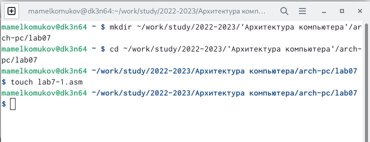

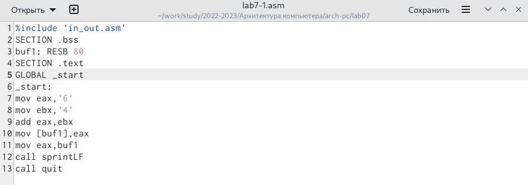

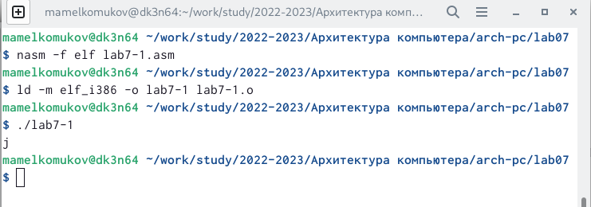

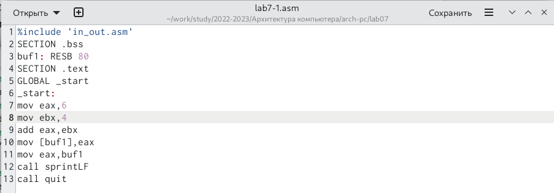

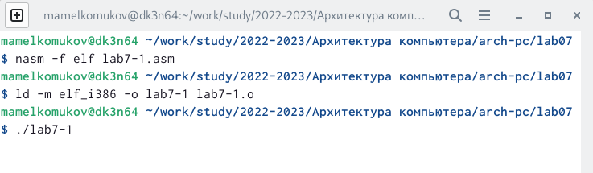

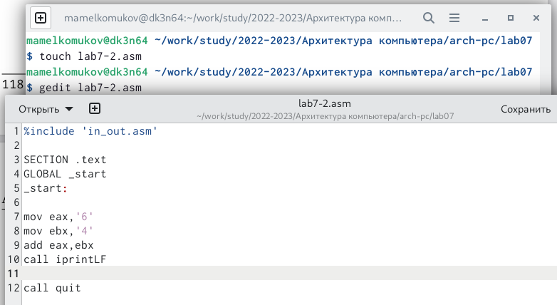

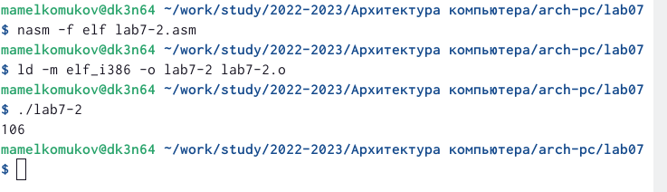

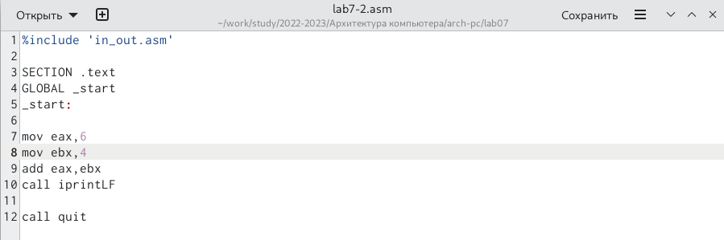

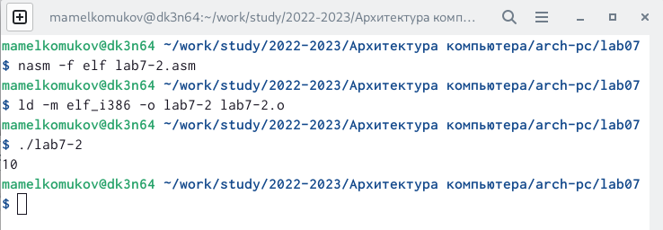

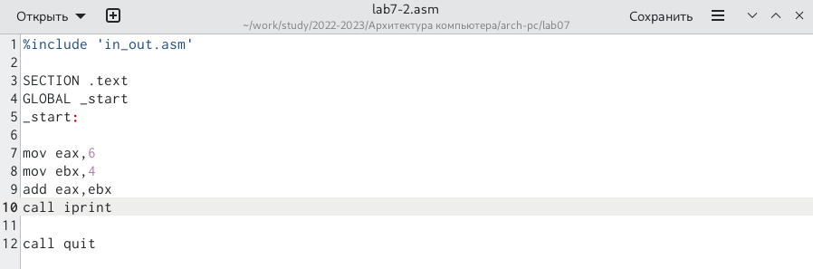

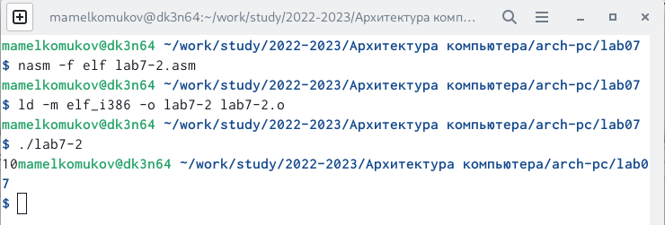

После вывода функции iprintLF ставится /n, а после iprint нет.

## Выполнение арифметических операций в NASM

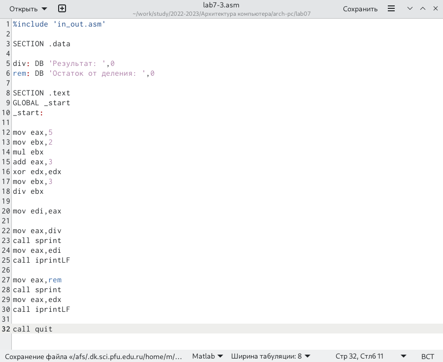

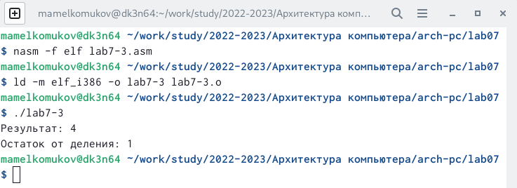

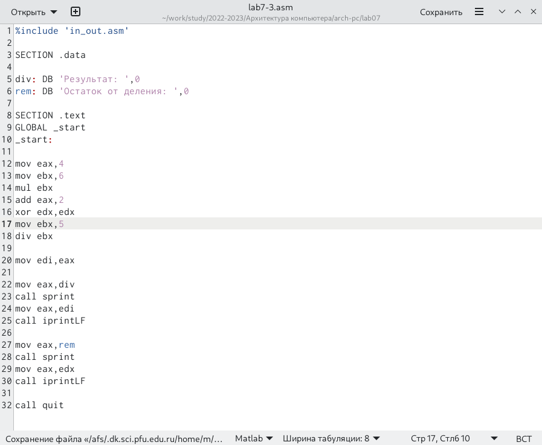

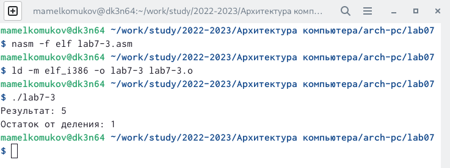

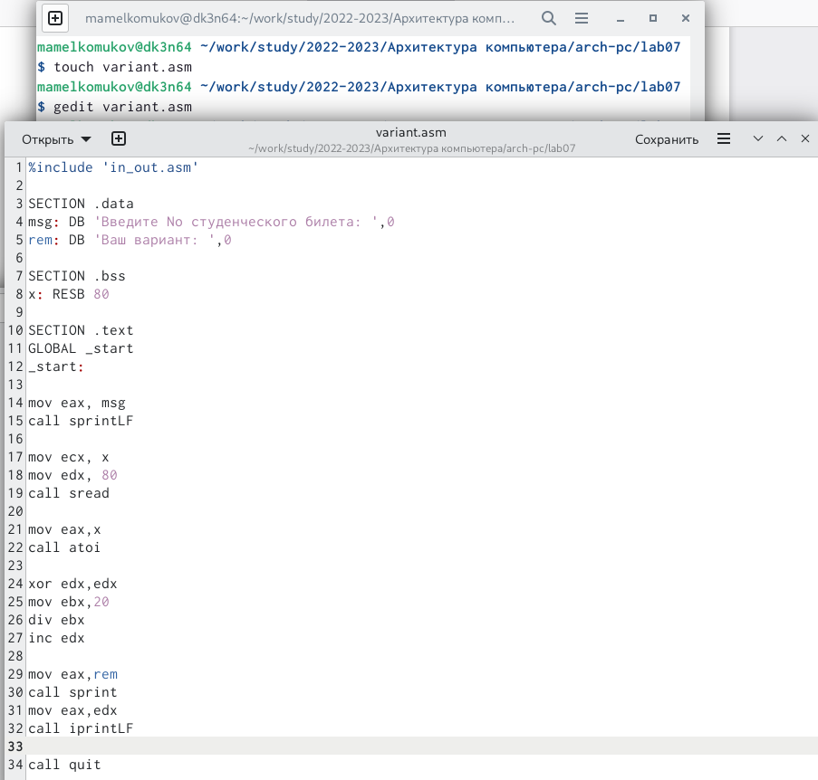

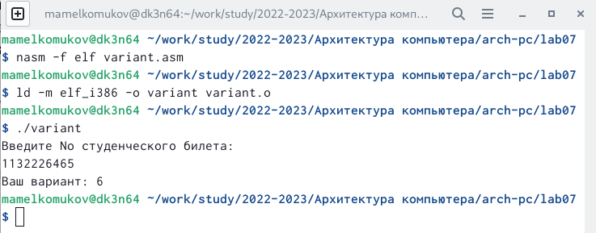

## Ответы на вопросы

1. Какие строки листинга 7.4 отвечают за вывод на экран сообщения ‘Ваш
вариант:’?
mov eax,rem
call sprint

2. Для чего используется следующие инструкции?
nasm - превращение текста программы в объектный код
mov ecx, x - перенести значение из x в ecx
mov edx, 80 - присвоить edx значение 80
call sread - ввод строки с клавиатуры

3. Для чего используется инструкция “call atoi”?
Преобразование символов в числа

4. Какие строки листинга 7.4 отвечают за вычисления варианта?
xor edx,edx
mov ebx,20
div ebx
inc edx

5. В какой регистр записывается остаток от деления при выполнении ин-
струкции “div ebx”?
edx

6. Для чего используется инструкция “inc edx”?
Увеличить остаток на один

7. Какие строки листинга 7.4 отвечают за вывод на экран результата вычис-
лений?
mov eax,edx
call iprintLF

# Выводы

Освоили арифметические инструкцие языка ассемблера NASM.

