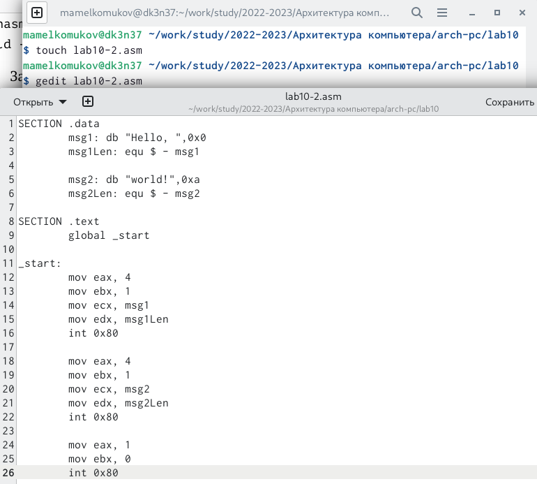
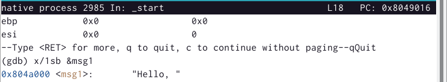

---
## Front matter
title: "Отчёт по лабораторной работе №10"
subtitle: "Понятие подпрограммы. Отладчик GDB."
author: "Михаил Александрович Мелкомуков"

## Generic otions
lang: ru-RU
toc-title: "Содержание"

## Bibliography
bibliography: bib/cite.bib
csl: pandoc/csl/gost-r-7-0-5-2008-numeric.csl

## Pdf output format
toc: true # Table of contents
toc-depth: 2
lof: true # List of figures
lot: true # List of tables
fontsize: 12pt
linestretch: 1.5
papersize: a4
documentclass: scrreprt
## I18n polyglossia
polyglossia-lang:
  name: russian
  options:
	- spelling=modern
	- babelshorthands=true
polyglossia-otherlangs:
  name: english
## I18n babel
babel-lang: russian
babel-otherlangs: english
## Fonts
mainfont: PT Serif
romanfont: PT Serif
sansfont: PT Sans
monofont: PT Mono
mainfontoptions: Ligatures=TeX
romanfontoptions: Ligatures=TeX
sansfontoptions: Ligatures=TeX,Scale=MatchLowercase
monofontoptions: Scale=MatchLowercase,Scale=0.9
## Biblatex
biblatex: true
biblio-style: "gost-numeric"
biblatexoptions:
  - parentracker=true
  - backend=biber
  - hyperref=auto
  - language=auto
  - autolang=other*
  - citestyle=gost-numeric
## Pandoc-crossref LaTeX customization
figureTitle: "Рис."
tableTitle: "Таблица"
listingTitle: "Листинг"
lofTitle: "Список иллюстраций"
lotTitle: "Список таблиц"
lolTitle: "Листинги"
## Misc options
indent: true
header-includes:
  - \usepackage{indentfirst}
  - \usepackage{float} # keep figures where there are in the text
  - \floatplacement{figure}{H} # keep figures where there are in the text
---

# Цель работы

Целью работы является приобретение навыков написания программ с использованием подпрограмм а также знакомство с методами отладки при помощи GDB и его основными возможностями.

# Задание

Узнать понятие подпрограммы, познакомиться с инструкциями call и ret. Ознакомиться с основными возможностями отладчика GDB: как запускать отладчик и выходить из него, как дизассемблировать программы, как устанавливать точки останова, как осуществлять пошаговую отладку, как работать с данными программы в GDB. На практике применить полученные знания.

# Выполнение лабораторной работы

## Реализация подпрограмм в NASM

## Отладка программ с помощью GDB

Переключились на отображение команд с Intel’овским синтаксисом, введя команду set disassembly-flavor intel, после чего снова посмотрели дисассимилированный код программы с помощью команды disassemble.

В режиме АТТ непосредственные операнды пишутся после '$', в то время как в режиме Intel операнды не выделяются. Регистровые операнды АТТ пишутся после '%', регистровые операнды Intel не выделяются.

## Добавление точек останова

## Работа с данными программы в GDB

Выполнили 5 инструкций с помощью команды si (stepi) и проследили за изменением значений регистров.

Изменили первый символ переменной msg1 с помощью команды set. Для этого задали ей в качестве аргумента имя регистра. Перед именем регистра поставили префикс $, а перед адресом в фигурных скобках указали тип данных.

Заменили три символа во второй переменной msg2: первый на 'L', четвёртый на ' ' и пятый на '%'.

Разница вывода команд p/s $ebx заключается в следующем: 

С помощью команды continue (сокращённо c) завершили выполнение программы и вышли из GDB с помощью команды quit (сокращенно q).

## Обработка аргументов командной строки в GDB

Число аргументов равно 5 – это имя программы lab10-3 и аргументы: аргумент1, аргумент, 2 и 'аргумент 3'.

Их адреса располагаются в четырёх байтах друг от друга, так как именно столько занимает элемент стека.

# Задание для самостоятельной работы

С помощью отладчика GDB проанализировали изменения значений регистров.

# Выводы

Приобрели навыки написания программ с использованием подпрограмм а также познакомились с методами отладки при помощи GDB и его основными возможностями.

