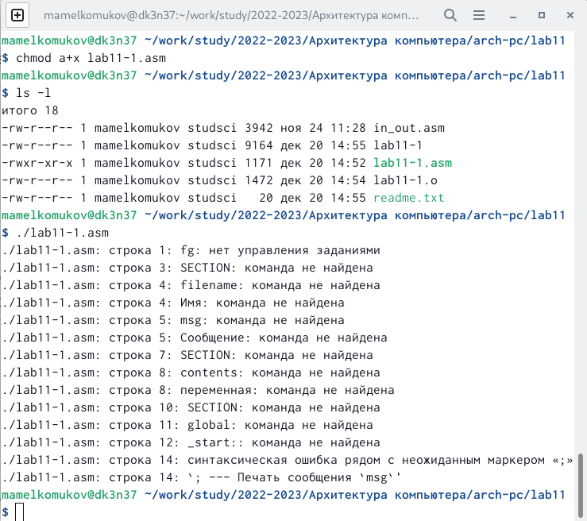

---
## Front matter
title: "Отчёт по лабораторной работе №11"
subtitle: "Работа с файлами средствами Nasm"
author: "Михаил Александрович Мелкомуков"

## Generic otions
lang: ru-RU
toc-title: "Содержание"

## Bibliography
bibliography: bib/cite.bib
csl: pandoc/csl/gost-r-7-0-5-2008-numeric.csl

## Pdf output format
toc: true # Table of contents
toc-depth: 2
lof: true # List of figures
lot: true # List of tables
fontsize: 12pt
linestretch: 1.5
papersize: a4
documentclass: scrreprt
## I18n polyglossia
polyglossia-lang:
  name: russian
  options:
	- spelling=modern
	- babelshorthands=true
polyglossia-otherlangs:
  name: english
## I18n babel
babel-lang: russian
babel-otherlangs: english
## Fonts
mainfont: PT Serif
romanfont: PT Serif
sansfont: PT Sans
monofont: PT Mono
mainfontoptions: Ligatures=TeX
romanfontoptions: Ligatures=TeX
sansfontoptions: Ligatures=TeX,Scale=MatchLowercase
monofontoptions: Scale=MatchLowercase,Scale=0.9
## Biblatex
biblatex: true
biblio-style: "gost-numeric"
biblatexoptions:
  - parentracker=true
  - backend=biber
  - hyperref=auto
  - language=auto
  - autolang=other*
  - citestyle=gost-numeric
## Pandoc-crossref LaTeX customization
figureTitle: "Рис."
tableTitle: "Таблица"
listingTitle: "Листинг"
lofTitle: "Список иллюстраций"
lotTitle: "Список таблиц"
lolTitle: "Листинги"
## Misc options
indent: true
header-includes:
  - \usepackage{indentfirst}
  - \usepackage{float} # keep figures where there are in the text
  - \floatplacement{figure}{H} # keep figures where there are in the text
---

# Цель работы

Приобрести навыки написания программ для работы с файлами. Научиться предоставлять права доступа к файлам.

# Выполнение лабораторной работы

После работы программы в файле записывается введённый пользователем текст. С помощью команды cat читаем содержимое файла.

После попытки выполнить файл высвечивается сообщение "Отказано в доступе". Это происходит, потому что мы убрали право на исполнение файла lab11-1 для всех пользователей с помощью команды chmod.

После попытки выполнить файл появляется множество ошибок. Это происходит, потому что мы добавили право на исполнение файла lab11-1.asm для всех пользователей, несмотря на то, что файл данного типа не расчитан на исполнение.

С помощью команды ls и ключа -l посмотрели права доступа пользователей ко всем файла в директории lab11.

# Задание для самостоятельной работы

# Выводы

Приобрели навыки написания программ для работы с файлами. Научились предоставлять права доступа к файлам.

